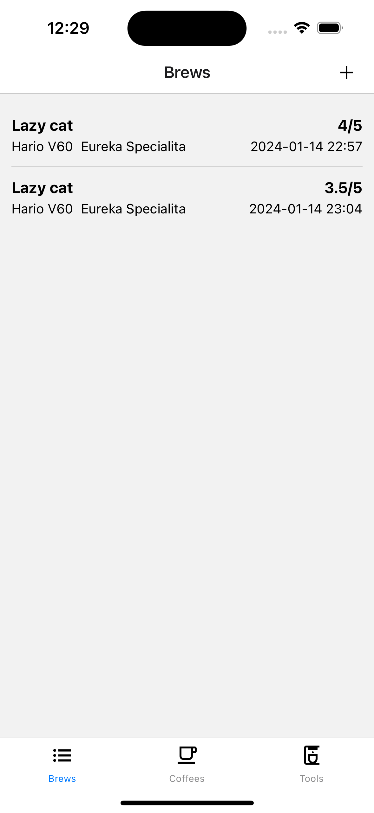
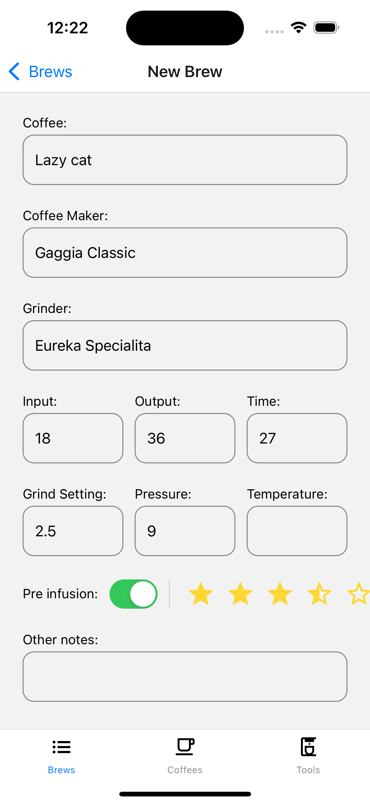
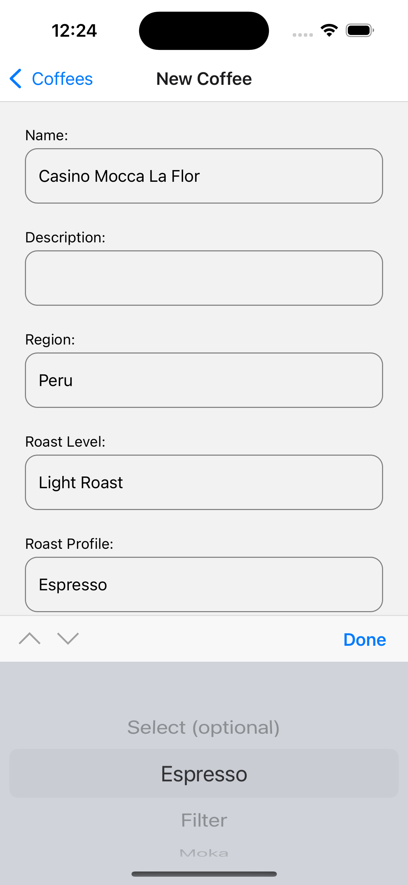
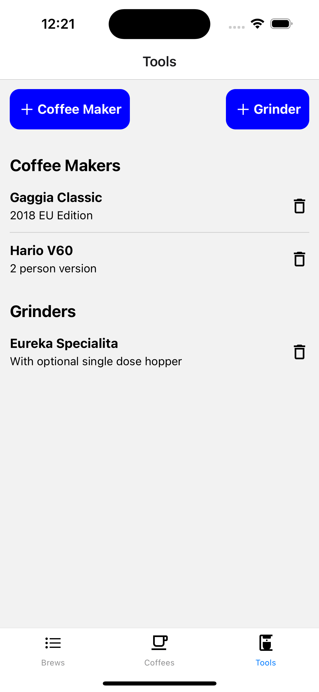

# Coffee Diary

## Monorepo

- backend: Go CRUD backend using Echo and Gorm
- mobile: React Native mobile app using React Query

   

## How to run

1. In the backend folder: `go run ./app`
2. In the mobile folder: `npm i && npm run dev`
